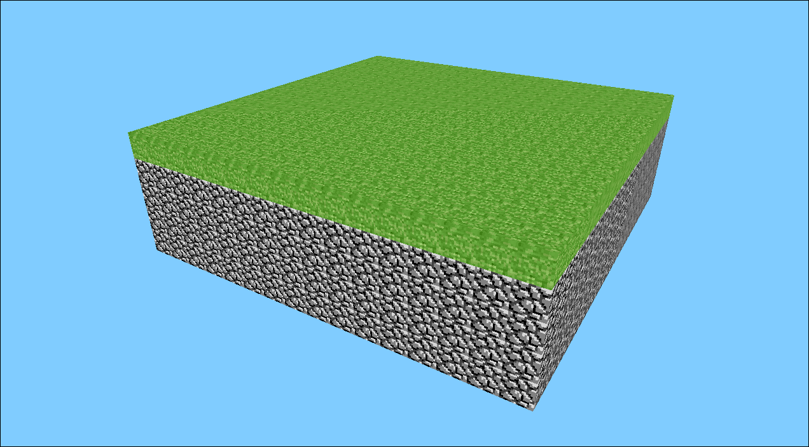

# Minecraft Alpha Go Clone Demo

A highly simplified 3D block game proof-of-concept, inspired by Minecraft, written entirely in Go within a **single source file** (`main.go`). This project demonstrates basic 3D rendering using OpenGL, first-person camera controls, world rendering, and texture mapping with an atlas.



**Disclaimer:** This is **NOT** a full Minecraft clone. It is a basic technical demo showcasing core concepts and lacks many essential game features. It was created as a specific exercise to fit within one Go file.

## Features

*   **3D Block World:** Renders a small, static world composed of cubes.
*   **OpenGL Rendering:** Uses Go bindings for OpenGL (v4.1 Core) for rendering.
*   **Texture Atlas Mapping:** Loads a `terrain.png` atlas and maps textures to different block types (Grass, Dirt, Stone). Grass, Dirt, and Stone currently use a single texture tile for all faces for performance reasons.
*   **First-Person Camera:** Standard mouse-look camera controls.
*   **Movement:** Fly mode using WASD, Space (Up), and Left Shift/Ctrl (Down). Includes a very basic ground collision check to prevent moving down through solid blocks.
*   **Basic Optimization:** Implements Frustum Culling to avoid drawing blocks outside the camera's view.
*   **Single File:** The entire codebase is contained within `main.go` as per the original challenge requirement.

## Limitations

This demo is intentionally simple and lacks numerous features found in full sandbox games:

*   **No Block Interaction:** Cannot break or place blocks.
*   **No Procedural World Generation:** The world is small and statically defined in `setupWorld()`.
*   **Limited Texturing:** Uses a single texture tile for all faces of Dirt, Stone, and Grass blocks (performance optimization). Per-face texturing was sacrificed for performance.
*   **No Chunking/Meshing:** Draws each visible block individually (1 draw call per block). This severely limits performance and world size. Proper games combine block geometry into larger meshes ("chunks").
*   **Basic Physics:** Only includes a check to prevent moving down into solid blocks. No realistic gravity, jumping, or complex collision detection.
*   **No Inventory/Crafting.**
*   **No Lighting:** Blocks are rendered with flat colors based on the texture.
*   **No Saving/Loading:** World state is lost when the program closes.
*   **No Sound.**
*   **No Mobs/Entities.**
*   **No Multiplayer.**
*   **No UI Elements:** No crosshair, health bar, inventory display, etc.

## Prerequisites

Before you can compile and run this demo, you need:

1.  **Go:** A recent version of the Go programming language (>= 1.18 recommended). [https://go.dev/dl/](https://go.dev/dl/)
2.  **C Compiler:** A C compiler like GCC (on Linux/macOS/WSL) or Clang (on macOS) is required by the CGo components used in the graphics libraries.
    *   **Linux (Debian/Ubuntu):** `sudo apt update && sudo apt install build-essential`
    *   **macOS:** Install Xcode Command Line Tools: `xcode-select --install`
    *   **Windows:** Requires setting up a C compiler environment like MinGW-w64 (via MSYS2 or other means).
3.  **OpenGL Development Libraries:** Libraries and headers for OpenGL and GLFW.
    *   **Linux (Debian/Ubuntu):** `sudo apt update && sudo apt install libgl1-mesa-dev xorg-dev libglfw3-dev libxxf86vm-dev` (ensure `libxxf86vm-dev` is included for linking)
    *   **Linux (Fedora):** `sudo dnf install mesa-libGL-devel libXrandr-devel libXinerama-devel libXcursor-devel libXi-devel libXxf86vm-devel glfw-devel`
    *   **macOS:** Install Homebrew ([https://brew.sh/](https://brew.sh/)) and run: `brew install glfw`
    *   **Windows:** This is complex. Using MSYS2 and installing `mingw-w64-x86_64-glfw` and related dependencies is a common approach.
4.  **Texture File:** The `terrain.png` texture atlas file must be present in the same directory as `main.go`.

## Setup and Installation

1.  **Get the Code:** Clone this repository or download/save the `main.go` file.
2.  **Get Texture:** Ensure the `terrain.png` file is in the same directory as `main.go`.
3.  **Open Terminal:** Navigate to the directory containing `main.go` and `terrain.png`.
4.  **Initialize Go Module (if needed):** Run this command once per project directory:
    ```bash
    go mod init gocraftdemo
    ```
    (You can replace `gocraftdemo` with any module name you prefer).
5.  **Download Dependencies:** Go will fetch the required libraries:
    ```bash
    go get github.com/go-gl/gl/v4.1-core/gl
    go get github.com/go-gl/glfw/v3.3/glfw
    go get github.com/go-gl/mathgl/mgl32
    ```
    *(Alternatively, running `go run main.go` or `go build` will often download dependencies automatically if a `go.mod` file exists).*

## How to Run

Execute the following command in your terminal from the project directory:

```bash
go run main.go